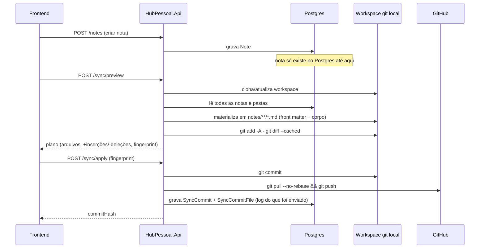

<p align="center">
  
</p>

<p align="center">
  
  
  
  
  
  
  
</p>

# Hub Pessoal — API

API do **Hub Pessoal**, um hub pessoal de notas, tarefas e cofre de arquivos. Este repositório cobre o **Módulo 1 — Sincronização Central**: autenticação, CRUD de notas e pastas em árvore, e um motor de sincronização bidirecional que espelha as notas do Postgres para um repositório git de verdade (GitHub).

Backend em **.NET 10** com **Clean Architecture**, banco **PostgreSQL** (Neon em produção, Docker em desenvolvimento), deploy no **Render**.

## Sumário

- [Arquitetura](#arquitetura)
- [Casos de uso](#casos-de-uso)
- [Fluxo do sistema — Notes](#fluxo-do-sistema--notes)
- [Uso das tecnologias](#uso-das-tecnologias)
- [Como rodar localmente](#como-rodar-localmente)
- [Como rodar os testes](#como-rodar-os-testes)
- [Documentação da API](#documentação-da-api)

## Arquitetura

Clean Architecture em quatro projetos, com dependência sempre apontando para dentro:

```
HubPessoal.Domain          → entidades puras (Note, NoteFolder, User, SyncCommit...), sem dependências externas
HubPessoal.Application     → casos de uso (Services), interfaces de repositório, contratos internos
HubPessoal.Infrastructure  → EF Core, repositórios, hashing de senha, cliente git
HubPessoal.Api             → minimal APIs, contratos HTTP, autenticação, Swagger
```

`Domain` não conhece ninguém. `Application` só conhece `Domain`. `Infrastructure` e `Api` conhecem `Application`, nunca o contrário — é por isso que os testes unitários (`HubPessoal.UnitTests`) conseguem testar toda a lógica de negócio mockando só interfaces, sem precisar de banco nem de git de verdade.

## Casos de uso

- **Autenticação** — login com usuário/senha (seed único, sem cadastro público), token JWT.
- **Notas e pastas em árvore** — criar, renomear, mover (com bloqueio de ciclo), fixar, duplicar, exportar `.md`, apagar (bloqueado se a pasta não estiver vazia).
- **Sincronização com git** — pré-visualizar o que mudou (`/sync/preview`), aplicar (`/sync/apply`, commit + pull + push), consultar histórico de commits (`/sync/history`). Sempre explícito: nada sincroniza sozinho em segundo plano.

## Fluxo do sistema — Notes

O Postgres é a cópia de trabalho (o que a UI lê e escreve o tempo todo); o repositório git é o histórico de verdade. Os dois só se encontram quando alguém aciona o sync — nunca automaticamente.



Cada nota vira um arquivo `notes/<pasta>/<Título>.md` com front matter (`id`, `tags`, `pinned`, `createdAt`) e o corpo em markdown puro — por isso o repositório git continua legível e editável fora do Hub Pessoal. Quando alguém edita ou cria um arquivo direto no GitHub, o próximo `/sync/apply` faz o caminho inverso: `git pull` traz o commit, e o conteúdo é reimportado para o Postgres (`ImportWorkspaceIntoDatabaseAsync`), com deduplicação de título e remoção do que não existe mais na árvore de arquivos.

## Uso das tecnologias

| Tecnologia | Por quê |
| --- | --- |
| **.NET 10 / Minimal APIs** | Endpoints diretos em `Program.cs`, sem a cerimônia de controllers para uma API deste tamanho. |
| **EF Core + Npgsql** | Migrations versionadas, LINQ para as consultas de árvore/repositório. |
| **PostgreSQL** | Índices únicos (título por pasta) e `text[]` nativo para tags — motivo pelo qual os testes de integração usam Postgres real via Testcontainers, não um banco em memória. |
| **FluentValidation** | Validação de request separada da lógica de negócio, plugada como `EndpointFilter`. |
| **JWT Bearer + Argon2** | Autenticação stateless; Argon2id (via `Konscious.Security.Cryptography`) para hash de senha — mais resistente a força bruta em GPU que PBKDF2/bcrypt. |
| **Git via subprocess** | `SyncService` chama o binário `git` diretamente (clone/add/commit/pull/push) em vez de uma lib como LibGit2Sharp — o repositório de notas é git de verdade, então usar o próprio git elimina qualquer divergência de comportamento. |
| **xUnit + Moq** | Testes unitários dos `Services`, mockando repositórios e `IGitClient` — rodam em milissegundos, sem Docker. |
| **Testcontainers.PostgreSql** | Testes de integração sobem um Postgres efêmero real (imagem `postgres:16`, a mesma do dev) — pega erros que um banco em memória não pegaria. |
| **Swashbuckle (Swagger)** | Documentação interativa dos endpoints, disponível em desenvolvimento. |

## Como rodar localmente

1. Subir o Postgres de desenvolvimento:

   ```bash
   docker-compose up -d
   ```

2. Configurar os segredos locais (nunca em `appsettings.json`):

   ```bash
   cd HubPessoal.Api
   dotnet user-secrets set "ConnectionStrings:DefaultConnection" "Host=localhost;Port=5432;Database=<DB_DEV_NAME>;Username=<DB_USER>;Password=<DB_PASSWORD>"
   dotnet user-secrets set "Jwt:Key" "uma-chave-longa-o-suficiente"
   dotnet user-secrets set "Jwt:Issuer" "hub-pessoal"
   dotnet user-secrets set "Jwt:Audience" "hub-pessoal"
   dotnet user-secrets set "Auth:SeedUsername" "dev-user"
   dotnet user-secrets set "Auth:SeedPassword" "uma-senha-qualquer"
   dotnet user-secrets set "Git:RepositoryUrl" "https://github.com/<usuario>/personal-hub-notes-dev.git"
   dotnet user-secrets set "Git:Token" "<personal access token com escopo de repo>"
   dotnet user-secrets set "Git:AuthorName" "Hub Pessoal Dev"
   dotnet user-secrets set "Git:AuthorEmail" "dev@example.com"
   ```

   As chaves `Git:*` (Frente 12) são obrigatórias — a API falha ao subir se alguma faltar (`GitOptions.EnsureConfigured`).

3. Rodar a API:

   ```bash
   dotnet run --project HubPessoal.Api
   ```

   As migrations rodam automaticamente no startup, junto com o seed do usuário de desenvolvimento.

## Como rodar os testes

```bash
dotnet test HubPessoal.UnitTests         # milissegundos, sem Docker
dotnet test HubPessoal.IntegrationTests  # precisa de Docker rodando (Testcontainers sobe/derruba o Postgres sozinho)
```

Os testes de integração não dependem do Postgres de desenvolvimento nem do GitHub real — usam um container efêmero e um repositório git `bare` local, então podem rodar com `docker-compose` de dev parado.

## Documentação da API

Com a API em desenvolvimento, o Swagger fica em [`http://localhost:5208/swagger`](http://localhost:5208/swagger) (ajuste a porta conforme sua configuração).

---

<p align="center"><sub>Versão do módulo em <code>version.config</code>. Documentação de arquitetura e decisões de projeto vivem fora deste repositório.</sub></p>
